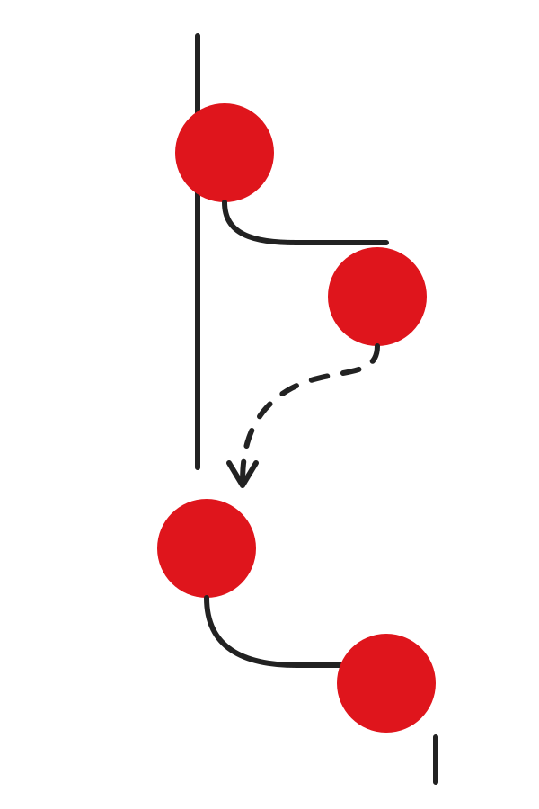
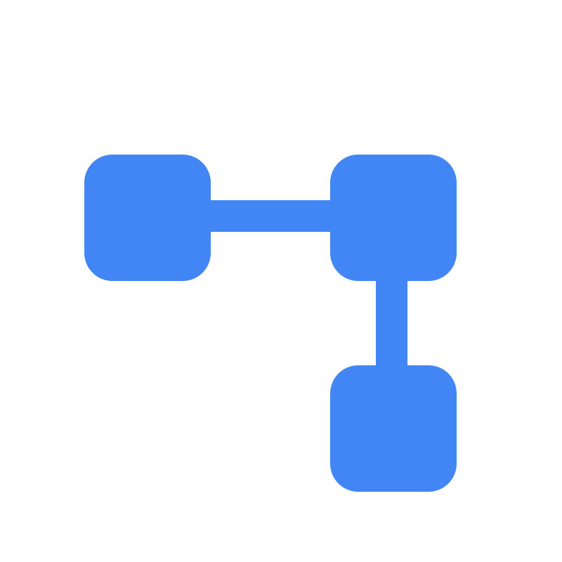

# مُخطِّط

### تطبيق تفاعلي لتعلّم المخططات الانسيابية عبر السحب والإفلات

[🔗 جرّب التطبيق مباشرة](https://muayad-babikeir.github.io/mukhattat/)

---

## 📖 نبذة

**مُخطِّط** تطبيق ويب تفاعلي يساعد طلاب البرمجة على تعلّم بناء المخططات الانسيابية (Flowcharts) بأسلوب السحب والإفلات، مع أكثر من 50 سؤالًا موزّعة على خمسة مستويات صعوبة متدرّجة.

## ✨ المميزات

- 🎯 أكثر من 50 سؤال تفاعلي عبر 5 مستويات صعوبة
- 🖱️ واجهة سحب وإفلات سلسة تدعم اللمس والفأرة
- ☁️ حفظ التقدم ومزامنته عبر السحابة
- 🏆 لوحة متصدرين وتحديات
- 🌐 دعم كامل للغة العربية واتجاه RTL
- ⚡ ملف واحد فقط — بدون أي مكتبات خارجية

## 🚀 رابط الاستخدام

👉 **[muayad-babikeir.github.io/mukhattat](https://muayad-babikeir.github.io/mukhattat/)**

## 🛠️ التقنيات المستخدمة

`HTML5` · `CSS3` · `JavaScript (Vanilla)`

## 👥 المساهمون

<table>
  <tr>
    <td align="center">
      <a href="https://t.me/+GFYEUUcGITg2MTU0">
         
        <b>CodeUp</b>
      </a> 
      التصميم والتطوير
    </td>
  </tr>
</table>

📩 انضم لمجموعة CodeUp على تلجرام: [t.me/+GFYEUUcGITg2MTU0](https://t.me/+GFYEUUcGITg2MTU0)

---

  © 2026 مُخطِّط — by CodeUp

